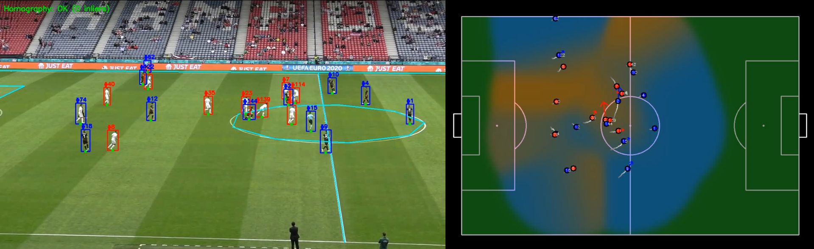

### Football Analysis & Spatial Insights

A computer vision project for extracting spatial insights from football (soccer) broadcast video. This tool combines object detection, tracking, and camera calibration to project player movements onto a 2D pitch map in real-time.

*This is a private project making some use of publicly available datasets to gain the features and models necessary for gaining some cool features of spatial and tactical analysis in football. 

Feel free to reach out if you want to collaborate! :D